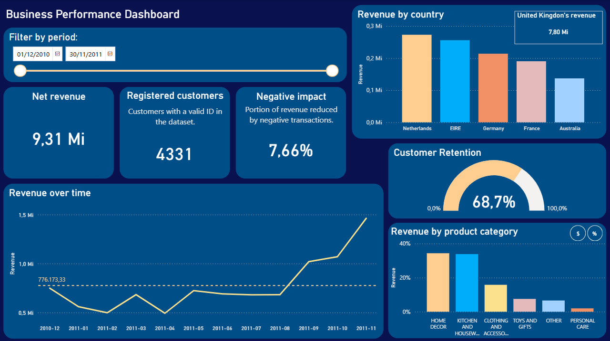

🇺🇸 English | 🇧🇷 [Versão em Português](README_pt-BR.md)

# Business performance analysis – E-commerce

## 1. Objective
The objective of this project is to analyze the sales behavior of an e-commerce over time, aiming to identify:
- consumption patterns
- revenue concentration
- customer recurrence levels
- potential operational risks (market or customer dependency)
- opportunities for improvement in retention and commercial strategy

The analysis is exploratory in nature but focused on generating insights applicable to business decision-making.

**Data source:**
Dataset publicly available at:
https://archive.ics.uci.edu/ml/machine-learning-databases/00352/Online%20Retail.xlsx

The dataset contains transactional data, including:
- InvoiceNo (order ID)
- StockCode (product ID)
- Description (product description)
- Quantity (quantity sold)
- InvoiceDate (transaction date)
- UnitPrice (unit price)
- CustomerID (customer ID)
- Country (country)
- Sales (total transaction value)

## 2. Project Files
This repository contains the following materials:

- **Notebook (Jupyter):** presents the data cleaning, preprocessing, and exploratory analysis steps, with a higher level of technical detail.
- **Dashboard (Power BI):** provides the main business views, highlighting revenue patterns, customer behavior, and relevant metrics.
- **Dashboard Image:** a visual representation of the final result (shown below).
- **README (PT-BR and EN):** project documentation available in both Portuguese and English, allowing better accessibility based on the reader’s preference.

## 3. Project steps
### 1. Extraction  
Data was loaded directly from the original file and structured for analysis in a Python environment.

### 2. Transformation (Data Cleaning)

#### a) Missing values  
- Description: removed (low proportion)  
- CustomerID: retained (~25% missing) to avoid losing relevant data volume  

#### b) Negative values  
- Retained, as they represent returns or financial adjustments affecting the final results  

#### c) Null values (UnitPrice = 0)  
- Removed, as they do not represent actual sales transactions  

#### d) Standardization and filtering  
- Removal of generic or ambiguous descriptions  
- Exclusion of records not directly related to sales (e.g., operational fees)  

### 3. Main analyses
#### a) Data quality and structure  
- Separation between actual sales and administrative records  

#### b) Revenue and distribution  
- Strong concentration of revenue in a few countries  
- The United Kingdom accounts for the largest share of total revenue  
- Indicates relevant geographic dependency  

#### c) Customer behavior  
- A large portion of customers make only one purchase  
- A small portion accounts for most of the revenue  

#### d) Recurrence vs Revenue  
- Frequent customers represent a small fraction of the customer base  
- However, they generate more than 50% of total revenue  
- Customer retention is more valuable than mass acquisition  

#### e) Impact of returns and adjustments  
- Identification of product categories with higher return rates  
- Returns and financial adjustments represent a 9.43% reduction in net revenue  
- Indicates the need for monitoring operational losses  

## 4. Business insights and contributions
- Retention strategies tend to generate more value than customer acquisition  
- Frequent customers should be treated as a strategic segment  
- Geographic diversification may reduce risk  
- Monitoring returns can improve operating margins  

## 5. Technologies used
Python; Pandas; Matplotlib; DAX; Power BI; Power Query; ETL; Statistic; Data cleaning.

## 6. Next steps
- More robust churn modeling (considering longer timeframes and customer behavior profiles)
- Customer segmentation (clustering)
- Integration with inventory and logistics data

## 7. Author
This project was fully developed by me, including data cleaning, exploratory analysis, interpretation of results, and visualization construction.
